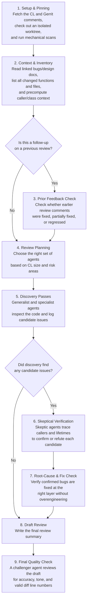
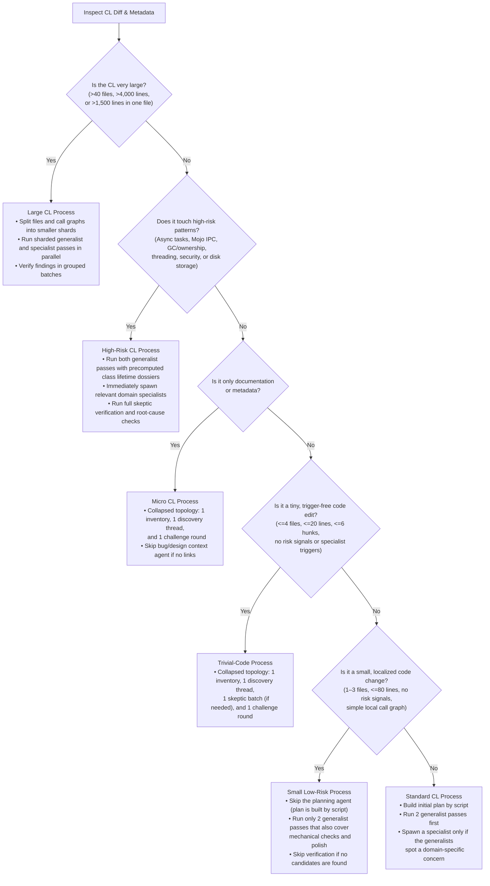
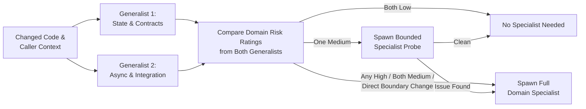

# Chromium Code Review Skill

This document explains how the `chromium-code-review` skill works. It is written for human readers; the agents themselves do not read this file during a review.

---

## 1. How the Skill Evolved

This skill was built iteratively through real Chromium code reviews. Whenever a review missed an edge case, produced a noisy or unhelpful suggestion, ran out of context on a large CL, or missed something that another human or AI reviewer caught, we looked at why it happened and updated the workflow to catch it next time.

A few core ideas came out of that process:

* **Separate finding potential issues from proving them:** When an agent tries to discover bugs and filter out false positives at the same time, it tends to dismiss good hunches too early ("maybe a caller checks this") while still letting plausible-sounding guesses slip through. We split the review into two distinct mindsets:
  * **Discovery** casts a wide net and writes down every potential issue or question without self-censoring.
  * **Verification** acts as a skeptic. A separate agent takes each candidate issue and traces the surrounding code, callers, and tests to either prove the bug is real or refute it before it ever appears in the review.
* **Fix the root cause, not the symptom:** Early versions of the skill would sometimes spot a real bug (like a null pointer or unexpected state) and suggest adding a local guard at the crash site, even when the real problem was a broken contract in the caller or owner. A dedicated **Root-Cause & Fix Optimality** step now checks whether a proposed fix is at the right architectural layer or if it's just a band-aid.
* **Keep each agent focused in a fresh context:** Trying to review an entire Chromium CL inside a single long conversation eventually fills up the context window and degrades attention on later files. Instead, the top-level agent acts only as a coordinator. It delegates the actual code reading to focused subagents that each get a clean context window and write their findings to files on disk.
* **Use scripts for mechanical work and state bookkeeping so agents can focus on judgment:** Tasks like running `clang-format`, finding all callers of a changed function across the repository, checking whether `WeakPtrFactory` is declared last in a class header, or checking that Gerrit comments point to valid diff lines are done by scripts in [`scripts/`](scripts/) before the agents start reading. Likewise, waiting on subagent waves (`await-workers.py`), transitioning work-unit states (`set-work-state.py`), and looking up gate errors (`explain-gate-error.py`) are handled by deterministic scripts that watch validated artifacts on disk rather than relying on subagent completion messages or manual TSV edits.

---

## 2. High-Level Review Flow

Every review follows the same general pipeline, moving from mechanical setup to broad discovery, skeptical verification, and final drafting.

---

## 3. Scaling to the Size and Complexity of the CL

To make sure the review selectively targets the appropriate areas and doesn't run the full gamut of agents on every CL, it first goes through a decision tree to understand the size and scope of the change.

A profiling script ([`scripts/profile-review.py`](scripts/profile-review.py)) inspects the diff size, the types of files touched, and whether the code touches higher-risk areas (such as async callbacks, Mojo IPC, memory ownership, threading, or persistence). Based on that profile and what the initial Inventory pass finds, the review scales across six levels:

### How Specialist Agents Are Triggered

Even on a standard or high-risk CL, the skill avoids running all 10 domain specialists unless they are needed:

1. **Two Generalist Passes Run First:** Two broad discovery agents—one focused on **State & Contracts** and one focused on **Async, Lifetimes & Integration**—review the whole change independently.
2. **Each Generalist Rates Domain Risk:** While reviewing the code, both generalists rate the likelihood (`low`, `medium`, or `high`) that each domain specialist is needed, citing the specific lines of code that raised or ruled out the concern.
3. **Selective Escalation:**
   * **Both say `low`:** That specialist is not spawned.
   * **One says `medium`:** A lightweight **Specialist Probe** is spawned to check just that specific question. If the probe finds everything is safe, it stops there; if it finds a deeper issue, it expands into a full specialist review.
   * **Either says `high`, both say `medium`, or the CL directly changes a high-risk boundary (like a `.mojom` interface):** A **Full Specialist Review** is spawned for that domain.

---

## 4. Precomputing Local Context: Async Chains, Lifetimes, and Directory Docs

Many of the most important Chromium bugs don't happen on the exact line that was edited—they happen two or three asynchronous hops away when a callback fires after an object was reset, or when a change subtly violates a subsystem rule documented in a parent directory's `README.md` or `DEPS` file.

If every subagent had to manually search the repository for callers, destructors, and ancestor `README.md` files, they would spend most of their budget running searches instead of reasoning about code. To give reviewers rich local context upfront, [`scripts/build-caller-index.py`](scripts/build-caller-index.py) (and [`scripts/profile-review.py`](scripts/profile-review.py)) precomputes three sets of context before discovery starts:

1. **Ancestor Directory Documentation, `OWNERS` & `DEPS` (`callers/directory-docs.md`):**
   Walks up the directory tree from every modified file (`a/b/c/` $\rightarrow$ `a/b/` $\rightarrow$ `a/`) and gathers:
   * **Subsystem `README.md` & design docs:** Captures the directory's intended mental model, threading rules, class hierarchy, and explicit deprecation warnings (e.g., *"Legacy pattern — do not add new uses of X; use Y instead"*).
   * **`OWNERS` architectural comments & review gates:** Extracts normative comments (`# Changes to Foo must also update Bar`) and `per-file` security/IPC review rules.
   * **`DEPS` layering contracts:** Extracts `include_rules`, `specific_include_rules`, and flags temporary `!` allowlist exceptions so reviewers catch when a CL expands a legacy dependency that is supposed to be removed.
   * **Two-Tier Consumption:** The **Context (`CTX`)** agent distills the core subsystem invariants and deprecations into `context.md` so every agent gets the big rules cheaply, while the **Holistic & Polish (`HAL`)** and **Root-Cause & Layering (`RC`)** agents also read the verbatim `callers/directory-docs.md` directly so they have the full subsystem architecture and layering rules when judging design, overengineering, and invariant ownership.
2. **Repository-Wide Caller Lists:** Every caller of every changed function across the repository, so agents can immediately see who calls the modified code.
3. **2-Hop Class Lifetime Dossiers:** For every C++ class modified by the CL, the script inspects the class's `.h` and `.cc` files and assembles a single summary document containing:
   * **Ownership & Lifetime Members:** All `raw_ptr`, `WeakPtrFactory`, Mojo `Receiver`/`Remote` endpoints, timers, `ScopedObservation`, and `SequenceChecker` fields—plus an automatic warning if `WeakPtrFactory` is declared *before* other members in the header (which can allow `WeakPtr` callbacks to run after sibling members are already destroyed).
   * **Hop 0 (Destructor & Teardown):** The class's destructor (`~ClassName()`), `Shutdown()`, `Reset()`, and Mojo disconnect handlers.
   * **Hop 1 → Hop 2 (Async Bindings & Callback Runs):** Every `BindOnce`, `BindRepeating`, `PostTask`, or timer registration referencing the class, right next to where callbacks and observer notifications are invoked.

---

## 5. Subagent Guide: What Each Agent Looks For and Why

### 5.1 Workflow & Verification Agents

These agents manage the stages of the review before and after discovery:

| Agent | What It Does & Why It Exists |
| :--- | :--- |
| **Context Agent (`CTX`)** | Reads linked bugs, design docs, the CL description, and the precompiled ancestor directory docs (`README.md`, `OWNERS`, `DEPS`). It distills the CL's goal alongside the **Subsystem Invariants, Deprecated Patterns, and Layering Rules** into `context.md` so every downstream reviewer knows both what the author is trying to solve and the rules of the directory being modified. |
| **Inventory Agent (`INV`)** | Lists every changed function, method, constructor, destructor, and diff hunk in the CL, and maps out how they connect. This guarantees that no part of a multi-file diff is accidentally skipped. |
| **Prior-Feedback Agent (`PF`)** | *(Used on follow-up patchsets)* Checks each comment from previous review rounds and unresolved Gerrit threads to verify whether the fix actually resolved the issue, or if repeated patchset edits ("fix-on-fix churn") introduced new bugs or left behind dead code. |
| **Planner Agent (`PLAN`)** | Used on large CLs (or when round-two specialists are needed) to divide large diffs into balanced chunks that fit comfortably inside each subagent's context window. |
| **Verification Skeptics (`V*`)** | The main filter against false positives. Each Skeptic takes a group of candidate issues from Discovery and tries to *disprove* them by checking real callers, preconditions, locks, and tests. Only issues proven reachable survive. |
| **Invariant Affinity Auditor (`IAR`)** | Checks all surviving findings side-by-side to make sure the review doesn't contradict itself or report the same underlying bug three different ways. |
| **Root-Cause Challenger (`RC`)** | Reads the confirmed findings alongside the verbatim ancestor directory docs (`callers/directory-docs.md`) to make sure we recommend fixing the documented canonical owner of the broken invariant—and reusing existing subsystem helpers—rather than suggesting a fragile caller workaround or crossing a `DEPS` layering boundary. |
| **Synthesis & Challenger Agents** | The **Synthesis** agent writes the human-facing review and anchors comments to exact diff lines. Before delivery, an independent **Challenger** agent audits the draft (capped at 2 rounds, or 1 when there are no promoted findings). Issues are classified as **substantive** (disputing a finding's existence, severity, root cause, or fix) or **clerical** (line-range anchors, headings, formatting); clerical defects are repaired in place by `collect-challenge-round.py` without triggering a full redraft. |

---

### 5.2 Core Discovery Agents (Run on Every Review)

Every review runs two independent generalist passes over the code. On larger reviews, mechanical checks and polish are split out into their own helper threads; on small low-risk reviews, they are folded directly into the two generalists.

| Agent | What It Looks For | Why It Exists |
| :--- | :--- | :--- |
| **Generalist 1: Semantic & State Discovery** | • Function contracts, pre/post-conditions, and state machine transitions. • Discarded return counts on `Push`/`Write`/`Send`/`Read` APIs where partial writes can silently drop bytes. • Mismatched sentinel constants (e.g., `kUnlimited = 0` in one file vs. `UINT64_MAX` in another). • Cache/persistence rollback safety (what happens if a Finch flag is turned off after new data is written to disk). • Overengineering (single-implementation interfaces, unused config knobs, speculative abstractions). | Catches logic, state, and contract bugs that happen inside the changed components and their immediate data structures. |
| **Generalist 2: Adversarial & Integration Discovery** | • Asynchronous callback lifetimes (`BindOnce`, `PostTask`, `base::Unretained`, timers) vs. object destruction and `Reset()`. • `WeakPtrFactory` member ordering and dangling `raw_ptr` risks (using the 2-Hop Class Lifetime Dossiers). • MPArch frame-tree bugs (making sure `WebContentsObserver` and `NavigationThrottle` hooks check `IsInPrimaryMainFrame()` and `HasCommitted()` so subframes, prerenders, or BFCache restores don't corrupt tab state). • Feature flag wiring and `fieldtrial_testing_config.json` drift (making sure default-off code paths are still tested when CQ enables a flag). | Looks at how the CL interacts with the rest of Chromium—focusing on async hops, lifetime ordering, and multi-component integration. |
| **Mechanical Leads** | • Triages the output of [`scripts/mechanical-leads.sh`](scripts/mechanical-leads.sh): `clang-format` diffs, whitespace, non-ASCII characters in comments, cross-component `#include`s missing `BUILD.gn` `deps`, feature flag polarity across files, and changed files with no matching test coverage. | Ensures mechanical issues and grep-detectable hazards are checked systematically without distracting the deep-reasoning agents. |
| **Changed-Lines Polish & Holistic (`HAL`)** | • Reads the verbatim ancestor `README.md`, `OWNERS`, and `DEPS` rules (`callers/directory-docs.md`) alongside `context.md`. • Checks whether new code invents custom helpers when a documented subsystem helper already exists, copies a deprecated local pattern, or leans on a temporary (`!`) `DEPS` exception. • Checks naming clarity, stale comments, direct `#include` hygiene, and whether the CL cleanly solves the stated bug without leaving dead plumbing. | Keeps minor readability nits separate from correctness bugs, and checks the overall architectural shape and local conventions of the CL. |

---

### 5.3 Domain Specialist Agents (Spawned When Triggered)

When the CL touches a specialized subsystem—or when either generalist flags a domain concern—the review spawns the corresponding specialist from [`references/chromium-specialist-checklists.md`](references/chromium-specialist-checklists.md):

| Specialist | What It Specializes In & What It Looks For | Why We Have It |
| :--- | :--- | :--- |
| **Threading & Synchronization (`TSY`)** | Lock ordering (AB-BA deadlocks), running callbacks while holding a lock, `std::atomic` memory ordering, `SEQUENCE_CHECKER` enforcement across thread hops, and `ThreadPool` shutdown behavior (`BLOCK_SHUTDOWN` vs. `SKIP_ON_SHUTDOWN`). | Concurrency bugs require tracing lock graphs and thread hops systematically rather than reading functions in isolation. |
| **Ownership & Blink Lifecycle (`OBL`)** | `raw_ptr` and reference cycles, Blink Oilpan garbage collection (`GarbageCollected`, `Member<T>`, `Trace()`), **V8 Heap & GC** (`HandleScope` leaks in loops, unrooted `Tagged<T>` across GC safepoints, write barriers, V8 Sandbox pointer tags), **`KeyedService` `DependsOn()`** factory shutdown dependencies, and Blink/DOM script re-entrancy. | Chromium mixes C++ RAII, ref-counting, Blink Oilpan GC, V8 HandleScopes, and `KeyedService` shutdown graphs; each has strict rules that cause UAFs when violated. |
| **Mojo IPC & Sandbox (`MIS`)** | `.mojom` interface changes, untrusted renderer-to-browser inputs (validating sizes, indices, origins, and tokens in the browser process), `ReceiverSet` context freshness across navigations, `[MinVersion]` backward compatibility, and OS sandbox policies. | Every Mojo call into the browser process is a security boundary where renderer inputs must be treated as potentially compromised. |
| **Performance & Resource Scaling (`PRS`)** | Unbounded caches or queues, $O(N^2)$ loops on hot IPC/UI paths, blocking disk/CPU work on the UI/IO thread, and **Skia / GPU rendering** (`SkSafeMath` overflow checks on image allocations, premultiplied alpha mixing, `GrRecordingContext` / Graphite thread affinity, and `.sksl` shaders). | Catches memory bloat, jank, and GPU/rendering hazards that pass functional tests on small inputs but fail at scale. |
| **Platform & Language Semantics (`PLS`)** | Cross-language boundaries (Java JNI, Rust FFI, Objective-C++ blocks), platform `#if BUILDFLAG(IS_*)` mismatches, **V8 Torque (`.tq`) & MacroAssembler** (`UnsafeCast` type proofs, missing `otherwise` labels, scratch register clobbering across calls), and **POSIX/macOS `.sh` script portability**. | Non-C++ files and compiler/assembler DSLs have completely different failure modes (like register clobbering or BSD vs. GNU shell flags) than standard C++. |
| **Build, API & Generated Assets (`BAG`)** | `BUILD.gn` target visibility, missing `deps` / `public_deps` for added `#include`s, `testonly` targets leaking into production builds, `DEPS` layering rules, and `*_EXPORT` component build macros. | Prevents build breakages on component/platform bots and protects architectural layering between directories. |
| **Privacy, Abuse & Telemetry (`PAT`)** | UMA `histograms.xml` and `enums.xml` definitions, UKM privacy/consent gating, enterprise policy schemas, and **Incognito / Off-The-Record `ProfileSelections`** (ensuring regular-profile state or identifiers never leak into Incognito or Guest profiles). | Telemetry and profile-routing mistakes can silently corrupt experiment data or leak user activity across Incognito boundaries. |
| **Accessibility & Internationalization (`AXI`)** | `AXNode`/`AXTree` roles, names, and state announcements for screen readers, keyboard navigation and focus restoration, high-contrast/forced-colors support, RTL layout mirroring, and `.grd` translation strings (`desc` and screenshot metadata). | Ensures UI changes work for keyboard and assistive-technology users and can be localized accurately across languages. |
| **Network Semantics (`NET`)** | Redirect handling (stripping credentials/headers across origins), `NetworkIsolationKey` and `CookiePartitionKey` isolation, HTTP cache `Vary` headers, CORS/CSP/CORP checks, and **persisted storage/pref rollback compatibility**. | Network and cache bugs often manifest as subtle cross-site leaks or broken cache entries after a Finch rollback. |
| **Fuzzing & Test Strategy (`FTS`)** | Checking whether new tests actually fail when the production fix is reverted, **`fieldtrial_testing_config.json`** flag-off test coverage (`InitAndDisableFeature`), **V8 `mjsunit` & `.status` files** (compiler tiering flags and architecture skip sections), Web Platform Tests (WPT), and libFuzzer/FuzzTest targets for untrusted parsers. | Ensures tests genuinely exercise the new code paths and catch regressions in the configurations that run on CI and in production. |

---

### 5.4 Focused Micro-Recipes (Spawned on Specific Code Patterns)

When a CL contains a particularly tricky local pattern—like complex index math, a multi-step error rollback path, or a new field added to a widely copied struct—the review can also spawn a small, single-purpose recipe agent from [`references/specialist-recipes.md`](references/specialist-recipes.md):

* **Desk-Check & Arithmetic Drills (`DCS`):** Plugs concrete boundary values (`0`, `1`, `max-1`, `max`, `SIZE_MAX`, empty) into index math and loop bounds to catch off-by-one and integer overflow bugs.
* **Error-Path Walk (`EPW`):** Forces each fallible call along a function to fail one by one and checks whether partially modified state is cleaned up or left inconsistent.
* **State × Method Matrix (`SMM`):** Crosses every state of a class (`kIdle`, `kStarting`, `kRunning`, `kStopped`) against every public method to catch out-of-order calls.
* **Callback & Task Lifetime (`CTL`):** Maps the exact creation, binding, reset, and destruction timeline of a complex multi-hop callback chain.
* **Teardown Order (`TDO`):** Checks bottom-to-top C++ member destruction order against destructor and `Shutdown()` logic.
* **Container & View Invalidation (`CVI`):** Checks whether `std::vector`, `flat_map`, `string_view`, or `base::span` references can be invalidated by mutations or re-entrant callbacks during iteration.
* **Field Propagation Matrix (`FPM`):** When a new field is added to a struct, class, or proto, checks that every copy constructor, `Clone()`, `operator==`, and serializer remembers to copy it.
* **Data Lineage (`DL`):** Follows a value from input to storage/output across type casts and clamping to catch silent truncation.
* **Mode × Host-Capability Matrix (`MHM`):** Checks combinations of runtime flags, enterprise policies, and OS capabilities.
* **Associative Container Semantics (`ACS`):** Checks custom map/set comparators, hash functions, and accidental `map[key]` default insertions.
* **Transformation Equivalence (`TER`):** Used on large mechanical refactors to verify which changes are 100% behavior-preserving and isolate any functions whose behavior subtly changed.
