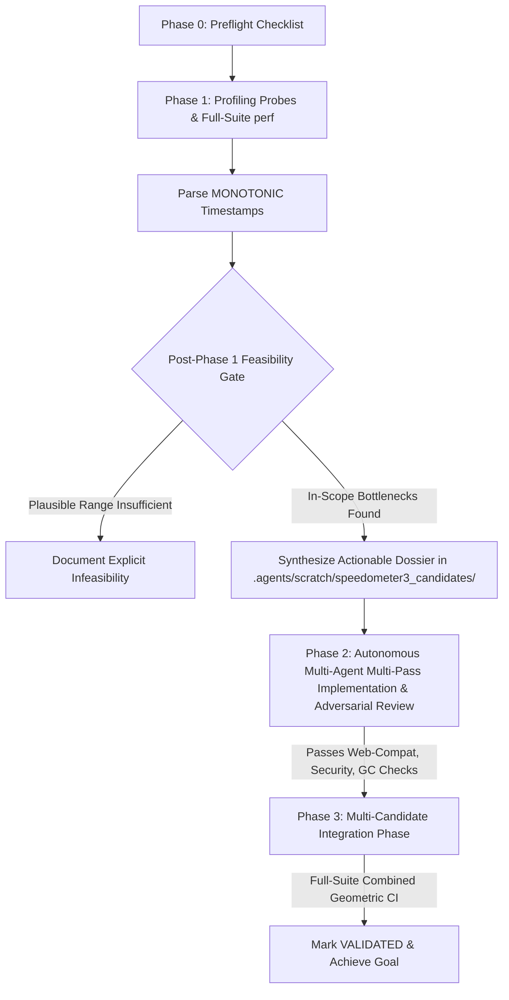

# Speedometer 3 Autonomous Optimization Runbook

This skill defines the methodology, measurement protocols, statistical guardrails, and empirical rules for discovering and validating performance improvements in Desktop Chromium against the **Speedometer 3** benchmark suite.

---

## 1. Environment Constraints & Core Principles

1. **Environment Constraints (Bare-Metal with PMU):**
   * The test environment is a physical bare-metal machine with fully functional hardware PMU counters.
   * All sampling `perf record` invocations SHOULD explicitly use `-e cycles -F 997 -k mono`.
2. **In-Repo Scope & Ownership Boundaries:** All code modifications must reside within Chromium main repository tracking (e.g., `//third_party/blink/`, `//base/allocator/`, `//content/`). Submodule/externally owned components (`//v8/*`, `//third_party/angle/*`, etc.) are strictly out of scope.
3. **Full-Suite Scope & Headless Screening:**
   * **Full Suite Scope:** Phase 1 profiling decisions MUST be based on a representative profile across the **full Speedometer 3 suite** (`--stories=all`). 
   * **Headless vs Desktop:** Local VM profiling executes headless (`--headless=new`). Desktop-mode Pinpoint trybots or bare-metal desktop runs are the authoritative ground truth for final validation.
4. **Full Chrome Process Tree Profiling & PID Manifest:**
   * Baselines specify system-wide `sudo perf record -e cycles -F 997 -k mono -g -a` with `--no-sandbox --js-flags=--perf-basic-prof` on an official build (`out/perf/chrome`).
   * Quality Rejection Gate: Reject profiles with poor unwinding, overall `[unknown]` frames >15%, concentrated `[unknown]` frames >10% within any dominant call stack, or insufficient samples (<5,000 samples).
5. **Multi-Candidate Integration Phase & Per-Story Regression Limits:**
   * Promising candidates MUST be evaluated in combination on a cumulative integration branch (`speedometer-5pct-integration`) across the full suite before declaring the overall goal achieved.
   * Individual candidate gains are non-additive.
   * Per-story regression limit: $\text{CI}_{\text{lower}} \ge \ln(0.98) \approx -2.0\%$.

---

## 2. Mandatory Phase 0 Preflight Checklist

Run these 5 preflight steps before launching Phase 1:

```bash
# 1. Software sampling check
perf stat -e cycles true

# 2. System-wide permissions check (must use sudo & -a)
sudo perf record -e cycles -F 997 -k mono -g -a -o /tmp/preflight-a.data -- sleep 2 && sudo perf report -i /tmp/preflight-a.data --stdio | head -5

# 3. Symbolization smoke test against live Chrome (using -k mono, --no-sandbox, & --js-flags=--perf-basic-prof)
out/perf/chrome --user-data-dir=/tmp/perf-profile --no-first-run --no-sandbox --headless=new --js-flags=--perf-basic-prof https://example.com &
CHROME_PID=$!
sleep 5
RENDERER_PID=$(ps aux | grep "type=renderer" | grep -v "grep" | head -n 1 | awk '{print $2}')
perf record -e cycles -F 997 -k mono -g -p $RENDERER_PID -o /tmp/preflight-jit.data -- sleep 5
kill $CHROME_PID || true
perf report -i /tmp/preflight-jit.data --stdio | head -50

# 4. Interleaved 10-rep Genuine A/A Baseline Calibration (--aa mode)
python3 .agents/skills/chrome-cycle-profiling/scripts/run_ab_benchmark.py --browser=out/perf/chrome --blocks=5 --aa

# 5. End-to-End Phase 1 Script Validation
python3 .agents/skills/chrome-cycle-profiling/scripts/run_cycle_benchmark.py --browser=out/perf/chrome --stories=NewsSite-Next
```

---

## 3. Staged Autonomous Workflow



### Phase 1: Sampler-Based Hot Spot Discovery & Feasibility Exit
1. **Disposable Worktree Setup & Probes:** Launch Phase 1 in disposable git worktree. Commit probes on disposable branch.
2. **Run Full-Suite System-Wide Sampling:** Run `run_cycle_benchmark.py --browser=out/perf/chrome --stories=all`
3. **Feasibility Gate & Hotspot Inventory:** Calculate sensitivity ranges. Author candidate dossiers in `.agents/scratch/speedometer3_candidates/` for EVERY in-scope call stack consuming ≥ 0.5% of the total inclusive CPU profile. Group them by related sub-systems (e.g. Layout, Parsers, CSS).

### Phase 2: Autonomous Multi-Agent Implementation (Multi-Pass & Documentation)
Instead of prototyping destructively first, we directly build secure, integrated fast-paths using structured AI subagents.
1. **Targeting by Opportunity:** The Tech Lead selects candidate bottlenecks to tackle, maintaining an incremental quota (e.g. 20 target integrations).
2. **MULTI-PASS MAXIMAL YIELD Implementation:** Spawns an **Implementation Engineer** subagent for the target. Instead of making a single quick-fix, the subagent MUST holistically analyze the function and deploy **multiple simultaneous optimizations** within the same iteration (e.g. short-circuit logic, Bloom filters, linear scans, MRU caches etc.) to squeeze every cycle out of the bottleneck.
   - **Feature Flag Constraint:** Changes must be gated via `blink::features::kSpeedometer3OptimizationSet`. Fast-path atomic state caches MUST ONLY use a single `std::atomic<int>` state machine (0=unchecked, 1=false, 2=true) utilizing `std::memory_order_relaxed`.
3. **Adversarial Review:** Instantly assigns an **Adversarial Review Engineer** to audit the patch against memory-safety and mechanical DOM specifications. The Review Engineer MUST compile and run relevant `blink_unittests` locally (`autoninja -C out/Default blink_unittests --gtest_filter=...`).
4. **Document Artifact Enforcement:** Upon integrating an accepted patch, you MUST log a detailed markdown report into `.agents/scratch/speedometer/reports/<Candidate_Number>_<Name>.md`. The report must include three sections: *Profile Opportunity*, *Exact Implementation Changes*, and *Why it is Safe (Review Engineer Verification)*.

### Phase 3: Multi-Candidate Integration Phase
* Maintain a cumulative integration branch (`speedometer-5pct-integration`). Merge accepted candidate commits sequentially onto this branch.
* Benchmark candidates in combination across the full Speedometer 3 suite natively.
* Declare the overall objective achieved ONLY when the **final combined patch** hits the CI target margin.

---

## 4. Quick Execution Command Reference

```bash
# 1. Compile fast component build for checking syntax
autoninja -C out/Default blink_core

# 2. Compile authoritative official PGO/LTO production binary
autoninja -C out/perf chrome

# 3. Full-suite perf sampling run with V8 symbolization (-k mono)
python3 .agents/skills/chrome-cycle-profiling/scripts/run_cycle_benchmark.py --browser=out/perf/chrome --stories=all

# 4. Genuine A/A noise floor calibration run (--aa mode)
python3 .agents/skills/chrome-cycle-profiling/scripts/run_ab_benchmark.py --browser=out/perf/chrome --blocks=5 --aa
```
