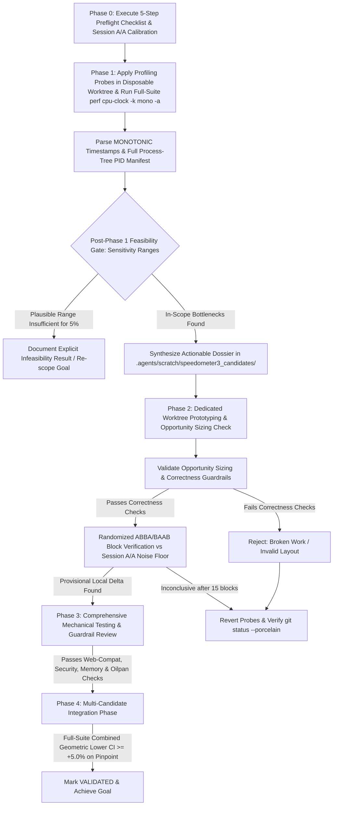

# Speedometer 3 Autonomous Optimization Runbook

This skill defines the methodology, measurement protocols, statistical guardrails, and empirical rules for discovering and validating performance improvements in Desktop Chromium against the **Speedometer 3** benchmark suite.

---

## 1. Environment Constraints & Core Principles

1. **Environment Constraints (Bare-Metal with PMU):**
   * The test environment is a physical bare-metal machine with fully functional hardware PMU counters.
   * All sampling `perf record` invocations SHOULD explicitly use `-e cycles -F 997 -k mono`.
   * Microarchitectural mechanisms (cache misses, stalls) can now be measured locally.
2. **In-Repo Scope & Ownership Boundaries:** All code modifications must reside within Chromium main repository tracking (e.g., `//third_party/blink/`, `//base/allocator/`, `//content/`). Submodule/externally owned components (`//v8/*`, `//third_party/angle/*`, etc.) are strictly out of scope based on path and repository ownership boundaries.
3. **Full-Suite Scope & Headless Screening:**
   * **Full Suite Scope:** Phase 1 profiling and feasibility scope-gate decisions MUST be based on a representative profile across the **full Speedometer 3 suite** (`--stories=all`). Single-story profiles are used strictly for localized candidate discovery.
   * **Headless vs Desktop:** Local VM profiling and verification runs execute headless (`--headless=new`). Local runs serve as relative A/B screening evidence. Desktop-mode Pinpoint trybots or bare-metal desktop runs are the authoritative ground truth for candidate promotion and final validation.
4. **Full Chrome Process Tree Profiling & PID Manifest:**
   * Baselines specify system-wide `sudo perf record -e cycles -F 997 -k mono -g -a` with `--no-sandbox --js-flags=--perf-basic-prof` on an official build (`out/perf/chrome`). The build is unmodified except for the two documented profiling probes (§3: `performance.cc` timestamp log, `benchmark-runner.mjs` mark emission).
   * Partition samples across ALL Chrome process roles: Browser, Renderers, GPU, and Utility processes. Generate two reports: (1) Full process tree, and (2) Renderer deep-dive.
   * Symbol map files (`/tmp/perf-*.map`) must survive in `/tmp` until all `perf report` and `perf script` flame graph generation steps are complete.
   * Filter process noise: Filter renderer analyses with renderer PID/TIDs to isolate renderer CPU execution.
   * Quality Rejection Gate: Reject profiles with unmatched marks, poor unwinding, overall `[unknown]` frames >15%, concentrated `[unknown]` frames >10% within any dominant call stack, or insufficient samples (<5,000 samples).
5. **Session A/A Calibration & Genuine A/A Mode (`--aa`):**
   - **Session A/A Calibration:** Measure local VM noise floor per session using `run_ab_benchmark.py --browser=out/perf/chrome --blocks=5 --aa` (both arms execute identical binaries and identical flags).
   - **Randomized Block-Interleaved Harness:** Run A/B comparisons in randomized ABBA/BAAB block order with fresh browser state per rep.
   - **Block Log-Difference Statistics:** Evaluate $d_b = \text{mean}(\ln B) - \text{mean}(\ln A)$ per block, paired 95% confidence intervals, and session MDE.
6. **Multi-Candidate Integration Phase & Per-Story Regression Limits:**
   - Speedometer 3 uses geometric mean aggregation across sub-scores ($\exp(\frac{1}{K}\sum \ln(1+\Delta_k)) - 1$). Individual candidate gains are non-additive.
   - Promising candidates MUST be evaluated in combination on a cumulative integration branch (`speedometer-5pct-integration`) across the full suite before declaring the 5% overall goal achieved.
   - Per-story regression limit: $\text{CI}_{\text{lower}} \ge \ln(0.98) \approx -2.0\%$ (lower bound must not fall below $-2.0\%$).
   - Goal achievement bar: Overall full-suite lower bound $\text{CI}_{\text{lower}} \ge \ln(1.05) \approx +5.0\%$.

---

## 2. Mandatory Phase 0 Preflight Checklist

Run these 5 preflight steps before launching Phase 1:

```bash
# 1. Software sampling check
perf stat -e cycles true

# 2. System-wide permissions check (must use sudo & -a)
sudo perf record -e cycles -F 997 -k mono -g -a -o /tmp/preflight-a.data -- sleep 2 && sudo perf report -i /tmp/preflight-a.data --stdio | head -5

# 3. Symbolization smoke test against live Chrome (using -k mono, --no-sandbox, & --js-flags=--perf-basic-prof)
out/perf/chrome --user-data-dir=/tmp/perf-profile --no-first-run --no-sandbox --headless=new --js-flags=--perf-basic-prof https://example.com &
CHROME_PID=$!
sleep 5
RENDERER_PID=$(ps aux | grep "type=renderer" | grep -v "grep" | head -n 1 | awk '{print $2}')
perf record -e cycles -F 997 -k mono -g -p $RENDERER_PID -o /tmp/preflight-jit.data -- sleep 5
kill $CHROME_PID || true
perf report -i /tmp/preflight-jit.data --stdio | head -50

# 4. Interleaved 10-rep Genuine A/A Baseline Calibration (--aa mode)
python3 .agents/skills/chrome-cycle-profiling/scripts/run_ab_benchmark.py --browser=out/perf/chrome --blocks=5 --aa

# 5. End-to-End Phase 1 Script Validation (Run AFTER applying profiling probes)
python3 .agents/skills/chrome-cycle-profiling/scripts/run_cycle_benchmark.py --browser=out/perf/chrome --stories=NewsSite-Next
```

---

## 3. Staged Autonomous Workflow



### Phase 1: Sampler-Based Hot Spot Discovery & Feasibility Exit
1. **Disposable Worktree Setup & Probes:**
   - Launch Phase 1 in disposable git worktree (`git worktree add ../perf-profile-phase1`). Commit probes on disposable branch (`git commit -m "Phase 1 profiling probes"`).
   - Mark emission: Verify `performance.mark("sp3-measurement-start")` and `performance.mark("sp3-measurement-end")` in `third_party/speedometer/v3.0/resources/benchmark-runner.mjs`.
   - C++ MONOTONIC probe: In `Performance::mark()` (`third_party/blink/renderer/core/timing/performance.cc`), query `clock_gettime(CLOCK_MONOTONIC, &ts)` when encountering measurement start/end marks, logging `[SP3_MONO_TIME] sp3-measurement-start: <sec>` to `stderr`.
2. **Run Full-Suite System-Wide Sampling:**
   ```bash
   python3 .agents/skills/chrome-cycle-profiling/scripts/run_cycle_benchmark.py --browser=out/perf/chrome --stories=all
   ```
3. **Parse Process Manifest & Slice Intervals:**
   - Extract MONOTONIC timestamps and full Chrome process-tree PIDs/TIDs (Browser, Renderer, GPU, Utility).
   - Generate two reports: (1) Full process tree, and (2) Renderer deep-dive via `perf script --time <start_sec>,<end_sec> --pid <renderer_pid>`.
4. **Quality Rejection Gate:** Reject profiles with unmatched measurement marks, poor call stack unwinding, overall `[unknown]` frames >15%, concentrated `[unknown]` frames >10% within any dominant call stack, or insufficient total samples (<5,000 samples).
5. **Post-Phase 1 Feasibility Gate:** Calculate sensitivity ranges (Optimistic, Plausible, Conservative). If the plausible scenario range does not support a 5% full-suite improvement, corroborate with wall-time traces before documenting an explicit infeasibility result or renegotiating target.
6. **Cleanup Worktree:** Remove disposable profiling worktree (`git worktree remove ../perf-profile-phase1`). Author candidate dossiers in `.agents/scratch/speedometer3_candidates/`.

### Phase 2: Dedicated Worktree Prototyping & Randomized A/B Validation
* **Worktree Isolation:** Every candidate experiment MUST run in a dedicated git worktree (`git worktree add ../candidate-<ID> candidate/<ID>-<name>`).
* **Opportunity Sizing Check:** CPU-clock sample share is an opportunity-sizing check, not a rigid rejection invariant.
* **Randomized Block-Interleaved A/B Verification:**
  - Run randomized ABBA/BAAB block repetitions using Crossbench:
    ```bash
    python3 .agents/skills/chrome-cycle-profiling/scripts/run_ab_benchmark.py --browser=out/perf/chrome --blocks=5 --feature=YourOptimizationFeature
    ```
* **Clean Working Tree Rule & Assertion:** Document diffs, Crossbench logs, and statistics into the dossier. Save accepted candidate implementations as explicit commits on candidate branches. Revert probes and verify clean state with `git status --porcelain`.

### Phase 3: Mechanical Testing & Correctness Guardrails
* Combine LLM intent reviews with comprehensive correctness guardrails: WPT tests, lifecycle ordering, MutationObservers, accessibility, focus/selection, custom elements, style invalidation, compositing, and Oilpan GC lifetime checks.

### Phase 4: Multi-Candidate Integration Phase
* Maintain a cumulative integration branch (`speedometer-5pct-integration`). Merge accepted candidate commits onto this branch.
* Benchmark candidates both individually and in combination across the full Speedometer 3 suite.
* Enforce per-story regression limits ($\text{CI}_{\text{lower}} \ge \ln(0.98) \approx -2.0\%$).
* Declare the overall 5% objective achieved ONLY when the **final combined patch** demonstrates lower 95% confidence bound $\text{CI}_{\text{lower}} \ge +5.0\%$ on desktop Pinpoint trybots or bare-metal hardware.

---

## 4. Quick Execution Command Reference

```bash
# 1. Compile fast component build for checking syntax
autoninja -C out/Default chrome

# 2. Compile authoritative official PGO/LTO production binary
autoninja -C out/perf chrome

# 3. Full-suite perf sampling run with V8 symbolization (-k mono)
python3 .agents/skills/chrome-cycle-profiling/scripts/run_cycle_benchmark.py --browser=out/perf/chrome --stories=all

# 4. Genuine A/A noise floor calibration run (--aa mode)
python3 .agents/skills/chrome-cycle-profiling/scripts/run_ab_benchmark.py --browser=out/perf/chrome --blocks=5 --aa

# 5. Randomized ABBA/BAAB block verification benchmark (5 blocks = 10 paired reps)
python3 .agents/skills/chrome-cycle-profiling/scripts/run_ab_benchmark.py --browser=out/perf/chrome --blocks=5 --feature=MyOptimizationFeature

# 6. Clean up transient Crossbench test results post-evaluation
rm -rf scratch/results_ab_interleaved_* scratch/results_perf_sampling_*
```
